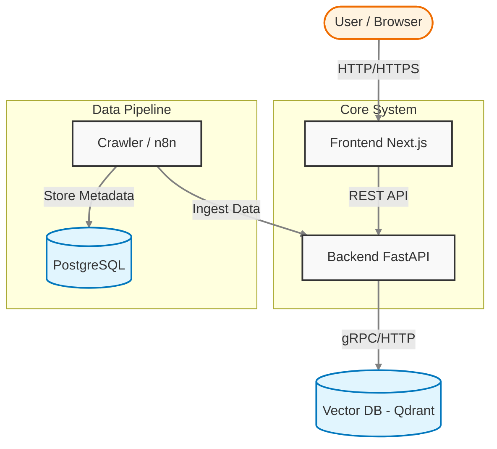

# VnSearch Engine 🚀

**VnSearch Engine** là một hệ thống tìm kiếm ngữ nghĩa (Semantic Search) hiện đại dành cho nội dung tiếng Việt. Hệ thống sử dụng công nghệ Vector Space Model để tìm kiếm các bài viết dựa trên ý nghĩa ngữ cảnh thay vì chỉ khớp từ khóa đơn thuần.



---

## 🏗 Kiến Trúc Hệ Thống

Hệ thống được xây dựng theo kiến trúc Microservices, đóng gói hoàn toàn bằng Docker:

| Service            | Công Nghệ                         | Port   | Mô Tả                                                                 |
| :----------------- | :-------------------------------- | :----- | :-------------------------------------------------------------------- |
| **Frontend (Web)** | Next.js 16, React 19, TailwindCSS | `3000` | Giao diện người dùng hiện đại, Responsive, Dark mode.                 |
| **Backend (API)**  | Python FastAPI, Scikit-learn      | `8000` | Xử lý NLP, Vector hóa (TF-IDF), API Search & Ingestion.               |
| **Vector DB**      | Qdrant                            | `6333` | Cơ sở dữ liệu Vector hiệu năng cao để lưu trữ và tìm kiếm tương đồng. |
| **Workflow**       | n8n                               | `5678` | Tự động hóa quy trình thu thập dữ liệu (Crawler).                     |
| **Database**       | PostgreSQL                        | `5432` | Database hỗ trợ cho n8n.                                              |

---

## ✨ Tính Năng Nổi Bật

- **🔍 Tìm kiếm ngữ nghĩa**: Hiểu ý định người dùng, trả về kết quả liên quan ngay cả khi không khớp từ khóa chính xác.
- **⚡️ Tốc độ cao**: Phản hồi tìm kiếm dưới 50ms nhờ tối ưu hóa Vector Indexing.
- **📱 Giao diện Responsive**: Tối ưu hoàn hảo cho Mobile, Tablet và Desktop.
- **🎨 Giao diện hiện đại**: Chế độ Dark/Light mode, hiệu ứng mượt mà.
- **clock Lịch sử tìm kiếm**: Lưu lại các từ khóa đã tìm kiếm gần đây.
- **⚙️ Data Pipeline**: Quy trình tự động thu thập, làm sạch và vector hóa dữ liệu từ Excel/Crawler.

---

## 🚀 Hướng Dẫn Cài Đặt & Chạy

### 1. Yêu Cầu

- **Docker** và **Docker Compose** đã được cài đặt.
- **Git** để clone source code.

### 2. Khởi Chạy Nhanh (Quick Start)

Bước 1: Clone repository

```bash
git clone <repo-url> vnsearch-engine
cd vnsearch-engine
```

Bước 2: Chạy script khởi động

```bash
cd setup
./start.sh
```

_(Script này sẽ tự động build image và start toàn bộ hệ thống)_

Bước 3: Truy cập

- **Web App**: [http://localhost:3000](http://localhost:3000)
- **API documentation**: [http://localhost:8000/docs](http://localhost:8000/docs)
- **Qdrant Search**: [http://localhost:6333/dashboard](http://localhost:6333/dashboard)
- **n8n Workflow**: [http://localhost:5678](http://localhost:5678)

---

## ⚙️ Cấu Hình & Deployment

### Cấu Hình Biến Môi Trường

Hệ thống đã được cấu hình sẵn cho môi trường chạy local. Tuy nhiên, nếu bạn muốn tùy chỉnh hoặc deploy server, hãy chú ý các file sau:

**1. Frontend (`microservices/irs_web/.env.local` hoặc `setup/docker-compose.yml`)**

- `NEXT_PUBLIC_API_BASE_URL`: Địa chỉ API Backend.
  - Local: `http://localhost:8000`
  - Server/Production: `http://<YOUR_SERVER_IP>:8000` (Client/Browser cần truy cập được).

**2. Backend (`microservices/irs_api/.env` hoặc `setup/docker-compose.yml`)**

- `QDRANT_HOST`, `QDRANT_PORT`: Kết nối đến Qdrant (mặc định dùng internal docker network).
- **Qdrant Cloud**: Nếu dùng Qdrant Cloud, thêm biến môi trường:
  - `QDRANT_URL`: `https://<cluster-url>.qdrant.tech`
  - `QDRANT_API_KEY`: `<your-api-key>`

### Build & Update Service

Nếu bạn sửa code và muốn cập nhật lại service, chạy lệnh:

```bash
# Tại thư mục setup/
docker-compose -p vnsearch-engine up -d --build irs_web
docker-compose -p vnsearch-engine up -d --build irs_api
```

### Triển Khai Lên Server (VPS)

1.  Copy toàn bộ source code lên server.
2.  Chỉnh sửa `setup/docker-compose.yml`: Cập nhật `NEXT_PUBLIC_API_BASE_URL` thành IP/Domain của server.
3.  Chạy `./setup/start.sh`.

---

## 📂 Cấu Trúc Dự Án

```
vnsearch-engine/
├── microservices/
│   ├── irs_web/           # Frontend Next.js Application
│   ├── irs_api/           # Backend FastAPI Application
│   └── vnexpress_crawler/ # Python Crawler Scripts
├── setup/                 # Docker Compose & Start scripts
├── metadata/              # Thư mục chứa dữ liệu (DB Persistence)
└── docs/                  # Tài liệu dự án
```

## 📝 License

Project này được phát triển cho mục đích học tập và nghiên cứu.
Author: Quoc Tang
