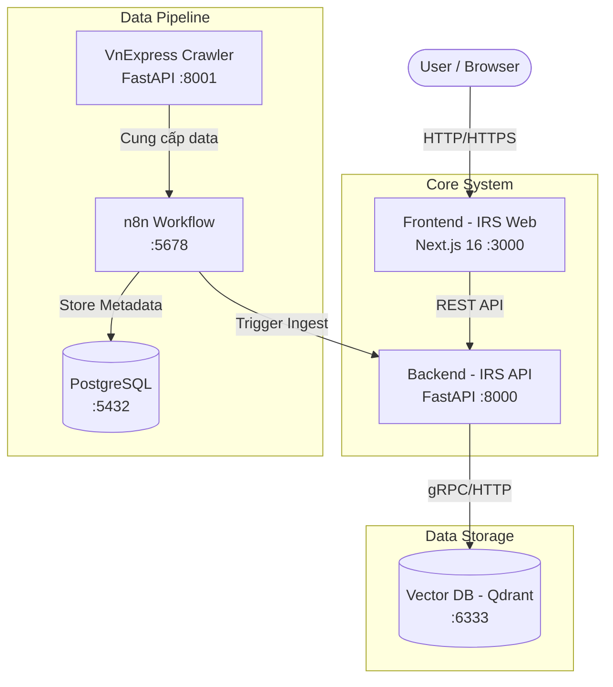
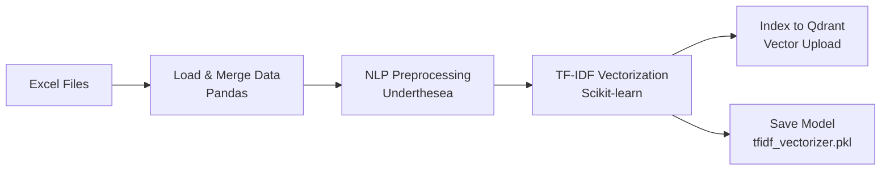
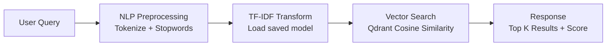

# 📋 PRD - Product Requirements Document

## VnSearch Engine - Hệ Thống Tìm Kiếm Ngữ Nghĩa Tiếng Việt

**Phiên bản**: 1.0.0  
**Ngày tạo**: 2026-02-16  
**Cập nhật lần cuối**: 2026-02-28  
**Tác giả**: Quoc Tang  
**Trạng thái**: ✅ Production Ready

---

## Mục Lục

1. [Tổng Quan Sản Phẩm](#1-tổng-quan-sản-phẩm)
2. [Kiến Trúc Hệ Thống](#2-kiến-trúc-hệ-thống)
3. [Service 1: IRS API (Backend)](#3-service-1-irs-api-backend)
4. [Service 2: IRS Web (Frontend)](#4-service-2-irs-web-frontend)
5. [Service 3: VnExpress Crawler](#5-service-3-vnexpress-crawler)
6. [Service 4: n8n Workflow Engine](#6-service-4-n8n-workflow-engine)
7. [Service 5: Qdrant Vector Database](#7-service-5-qdrant-vector-database)
8. [Service 6: PostgreSQL Database](#8-service-6-postgresql-database)
9. [Yêu Cầu Phi Chức Năng](#9-yêu-cầu-phi-chức-năng)
10. [Deployment & Infrastructure](#10-deployment--infrastructure)
11. [Roadmap](#11-roadmap)

---

## 1. Tổng Quan Sản Phẩm

### 1.1. Tầm nhìn (Vision)

**VnSearch Engine** là hệ thống tìm kiếm ngữ nghĩa (Semantic Search) hiện đại dành cho nội dung tiếng Việt. Thay vì tìm kiếm truyền thống dựa trên khớp từ khóa (keyword matching), hệ thống sử dụng mô hình **Vector Space Model** kết hợp **TF-IDF** để hiểu ý nghĩa ngữ cảnh của truy vấn và trả về kết quả có liên quan về mặt ngữ nghĩa.

### 1.2. Vấn đề cần giải quyết

| Vấn đề                                           | Giải pháp                                                       |
| ------------------------------------------------ | --------------------------------------------------------------- |
| Tìm kiếm từ khóa truyền thống chỉ khớp chính xác | Tìm kiếm ngữ nghĩa dựa trên Vector Space Model                  |
| Tiếng Việt thiếu công cụ NLP tốt                 | Sử dụng Underthesea (tách từ tiếng Việt) + Vietnamese Stopwords |
| Tốc độ tìm kiếm trên lượng data lớn              | Vector Database Qdrant với indexing tối ưu (< 50ms)             |
| Thu thập dữ liệu thủ công                        | Pipeline tự động qua Crawler API + n8n Workflow                 |

### 1.3. Đối tượng người dùng

| Persona            | Mô tả                            | Use Case                            |
| ------------------ | -------------------------------- | ----------------------------------- |
| **Người đọc tin**  | Người dùng cuối tìm kiếm bài báo | Tìm bài viết theo chủ đề, ngữ cảnh  |
| **Admin hệ thống** | Quản lý data, trigger ingestion  | Nạp dữ liệu, monitor hệ thống       |
| **Nhà nghiên cứu** | Nghiên cứu NLP/IR tiếng Việt     | Đánh giá hiệu quả thuật toán TF-IDF |

### 1.4. Các tính năng nổi bật

- 🔍 **Tìm kiếm ngữ nghĩa**: Hiểu ý định người dùng, trả về kết quả liên quan ngay cả khi không khớp từ khóa chính xác
- ⚡ **Tốc độ cao**: Phản hồi tìm kiếm dưới 50ms nhờ tối ưu hóa Vector Indexing
- 📱 **Giao diện Responsive**: Tối ưu cho Mobile, Tablet và Desktop
- 🎨 **UI hiện đại**: Dark/Light mode, 3D Hero Background, hiệu ứng Framer Motion
- 🕐 **Lịch sử tìm kiếm**: Lưu từ khóa đã tìm kiếm gần đây (localStorage)
- ⚙️ **Data Pipeline tự động**: Thu thập, làm sạch và vector hóa dữ liệu từ VnExpress

---

## 2. Kiến Trúc Hệ Thống

### 2.1. Kiến trúc tổng quan

Hệ thống được xây dựng theo kiến trúc **Microservices**, đóng gói hoàn toàn bằng **Docker Compose**.



### 2.2. Bảng tổng hợp Services

| #   | Service                | Công nghệ                         | Port   | Vai trò                                                        | Trạng thái |
| --- | :--------------------- | :-------------------------------- | :----- | :------------------------------------------------------------- | :--------- |
| 1   | **IRS API (Backend)**  | Python FastAPI, Scikit-learn      | `8000` | NLP, Vector hóa (TF-IDF), API Search & Ingestion               | ✅ Done    |
| 2   | **IRS Web (Frontend)** | Next.js 16, React 19, TailwindCSS | `3000` | Giao diện tìm kiếm, Responsive, Dark mode                      | ✅ Done    |
| 3   | **VnExpress Crawler**  | Python FastAPI                    | `8001` | Thu thập dữ liệu từ VnExpress (Categories, Articles, Comments) | ✅ Done    |
| 4   | **n8n Workflow**       | n8n                               | `5678` | Tự động hóa pipeline thu thập dữ liệu                          | ✅ Done    |
| 5   | **Qdrant**             | Qdrant                            | `6333` | Vector DB lưu trữ & tìm kiếm tương đồng                        | ✅ Done    |
| 6   | **PostgreSQL**         | PostgreSQL 18                     | `5432` | Database hỗ trợ n8n                                            | ✅ Done    |

---

## 3. Service 1: IRS API (Backend)

### 3.1. Tổng quan

**Vai trò**: Trung tâm xử lý NLP, vector hóa dữ liệu và phục vụ API tìm kiếm ngữ nghĩa.

**Công nghệ**:

- **Framework**: FastAPI
- **Data Processing**: Pandas, NumPy
- **NLP**: Underthesea (`word_tokenize` cho tiếng Việt)
- **ML Model**: Scikit-learn (`TfidfVectorizer`)
- **Vector DB Client**: `qdrant-client`
- **Config**: Pydantic Settings
- **Runtime**: Python, Docker

### 3.2. Cấu trúc thư mục

```
irs_api/
├── main.py                    # FastAPI app entry point + Lifespan
├── app/
│   ├── api/v1/
│   │   ├── health.py          # GET / - Health check endpoint
│   │   ├── search.py          # POST /api/v1/search - Search endpoint
│   │   ├── ingest.py          # POST /api/v1/ingest - Ingestion endpoint
│   │   └── dependencies.py    # Dependency injection (TF-IDF service)
│   ├── core/
│   │   └── config.py          # Pydantic Settings (env vars)
│   ├── models/
│   │   ├── request.py         # SearchRequest model
│   │   └── response.py        # HealthResponse, SearchResponse, IngestResponse
│   ├── services/
│   │   ├── ingestion_service.py # Data ingestion pipeline
│   │   ├── nlp_processor.py     # Vietnamese NLP (tokenize, stopwords)
│   │   ├── qdrant_service.py    # Qdrant DB operations
│   │   └── tfidf_service.py     # TF-IDF vectorization
│   └── utils/
│       ├── excel_loader.py    # Load & merge Excel files
│       └── stopwords_loader.py # Load Vietnamese stopwords
├── assets/
│   ├── excel/                 # articles.xlsx, categories.xlsx, comments.xlsx
│   └── txt/                   # vietnamese-stopwords.txt
├── models/                    # tfidf_vectorizer.pkl (saved model)
├── Dockerfile
├── pyproject.toml
└── .env
```

### 3.3. API Specifications

#### API 1: Health Check

| Thuộc tính   | Chi tiết                             |
| ------------ | ------------------------------------ |
| **Method**   | `GET`                                |
| **URL**      | `/`                                  |
| **Mục đích** | Kiểm tra trạng thái Backend & Qdrant |

**Response** (200 OK):

```json
{
  "status": "healthy",
  "qdrant_connected": true,
  "model_loaded": true
}
```

| Response Field     | Type    | Mô tả                          |
| ------------------ | ------- | ------------------------------ |
| `status`           | string  | `"healthy"` hoặc `"unhealthy"` |
| `qdrant_connected` | boolean | Trạng thái kết nối Qdrant      |
| `model_loaded`     | boolean | TF-IDF model đã được load      |

---

#### API 2: Search Articles (⭐ Core API)

| Thuộc tính   | Chi tiết                                         |
| ------------ | ------------------------------------------------ |
| **Method**   | `POST`                                           |
| **URL**      | `/api/v1/search`                                 |
| **Mục đích** | Tìm kiếm semantic bài viết theo query tiếng Việt |

**Request Body**:

```json
{
  "query": "công nghệ trí tuệ nhân tạo",
  "limit": 10,
  "category_filter": "Khoa học"
}
```

| Request Field     | Type    | Required | Validation  | Mô tả                       |
| ----------------- | ------- | -------- | ----------- | --------------------------- |
| `query`           | string  | **Yes**  | 1-500 ký tự | Từ khóa tìm kiếm tiếng Việt |
| `limit`           | integer | No       | 1-100       | Số kết quả (default: 10)    |
| `category_filter` | string  | No       | -           | Lọc theo danh mục           |

**Danh mục hỗ trợ**: `"Khoa học"`, `"Ý kiến"`, `"Giáo dục"`, `"Sức khỏe"`, `"Thời sự"`, `"Giải trí"`, `"Đời sống"`

**Response** (200 OK):

```json
{
  "query": "công nghệ AI",
  "processed_query": "công_nghệ",
  "total_results": 2,
  "execution_time_ms": 54.32,
  "results": [
    {
      "id": 1635,
      "score": 0.465,
      "article_id": 4828056,
      "title": "Những chính sách khoa học công nghệ được kỳ vọng năm 2025",
      "summary": "Năm 2025, Chính phủ, Bộ Khoa học và Công nghệ xác định...",
      "url": "https://vnexpress.net/...",
      "category_name": "Khoa học",
      "comment_count": 1
    }
  ]
}
```

| Response Field      | Type    | Mô tả                                      |
| ------------------- | ------- | ------------------------------------------ |
| `query`             | string  | Query gốc từ request                       |
| `processed_query`   | string  | Query sau xử lý NLP (tokenized, stopwords) |
| `total_results`     | integer | Tổng số kết quả tìm được                   |
| `execution_time_ms` | float   | Thời gian xử lý (ms)                       |
| `results`           | array   | Danh sách article results                  |

**Article Result Object**:

| Field           | Type    | Mô tả                                              |
| --------------- | ------- | -------------------------------------------------- |
| `id`            | integer | Vector ID trong Qdrant                             |
| `score`         | float   | Độ tương đồng semantic (0.0 - 1.0, cao = relevant) |
| `article_id`    | integer | ID bài viết gốc                                    |
| `title`         | string  | Tiêu đề bài viết                                   |
| `summary`       | string  | Tóm tắt nội dung                                   |
| `url`           | string  | URL bài viết                                       |
| `category_name` | string  | Tên danh mục                                       |
| `comment_count` | integer | Số lượng comments                                  |

**Error Responses**:

- `400 Bad Request`: Validation error (query rỗng, limit > 100)
- `500 Internal Server Error`: Model chưa load, Qdrant không kết nối

---

#### API 3: Trigger Ingestion (Admin Only)

| Thuộc tính   | Chi tiết                                           |
| ------------ | -------------------------------------------------- |
| **Method**   | `POST`                                             |
| **URL**      | `/api/v1/ingest`                                   |
| **Mục đích** | Kích hoạt pipeline nạp dữ liệu từ Excel vào Qdrant |

**Request**: Không có body.

**Response** (200 OK):

```json
{
  "status": "success",
  "articles_count": 2232,
  "vector_dimension": 3740,
  "qdrant_collection": "articles",
  "qdrant_points": 2232,
  "categories": 7,
  "model_path": "models/tfidf_vectorizer.pkl"
}
```

| Response Field      | Type    | Mô tả                          |
| ------------------- | ------- | ------------------------------ |
| `status`            | string  | `"success"` hoặc `"error"`     |
| `articles_count`    | integer | Số articles đã index           |
| `vector_dimension`  | integer | Số chiều của TF-IDF vector     |
| `qdrant_collection` | string  | Tên collection trong Qdrant    |
| `qdrant_points`     | integer | Tổng điểm dữ liệu trong Qdrant |
| `categories`        | integer | Số danh mục unique             |
| `model_path`        | string  | Đường dẫn model đã lưu         |

> ⚠️ **Lưu ý**: Endpoint này chạy 30-60 giây. Không expose cho end users.

### 3.4. Luồng xử lý dữ liệu

#### 3.4.1. Luồng nạp dữ liệu (Data Ingestion Pipeline)



**Chi tiết các bước**:

1. **Load Data**: Đọc `Articles.xlsx`, `Categories.xlsx`, `Comments.xlsx`
2. **Merge & Clean**: Join category_name, comment_count vào Article. Tạo `full_text = title + " " + summary`
3. **NLP Preprocessing**: Tokenize tiếng Việt (Underthesea) → Lowercase → Remove Stopwords
4. **Vectorization**: Fit `TfidfVectorizer` → Transform toàn bộ văn bản → Lưu model (pickle)
5. **Indexing**: Upload Vector + Payload vào Qdrant Collection

#### 3.4.2. Luồng tìm kiếm (Search Flow)



**Chi tiết các bước**:

1. **Receive**: API nhận `query` string
2. **Preprocessing**: Áp dụng quy trình NLP giống ingestion
3. **Vectorization**: Load model TF-IDF đã lưu, transform query thành vector (không fit lại)
4. **Search**: Gửi vector sang Qdrant → Top K kết quả (Cosine Similarity) + Optional filter
5. **Response**: Trả về danh sách bài báo kèm điểm số tương đồng

### 3.5. Cấu trúc dữ liệu Qdrant

Mỗi "point" trong Qdrant có cấu trúc:

- **ID**: `article_id` (Integer)
- **Vector**: Dense Vector từ TF-IDF (ví dụ: 3740 chiều)
- **Payload (Metadata)**:

```json
{
  "title": "String",
  "summary": "String",
  "url": "String",
  "thumbnail_url": "String",
  "published_at": "String (ISO Date)",
  "category_name": "String",
  "comment_count": "Integer"
}
```

### 3.6. Cấu hình môi trường

| Biến                     | Mặc định                              | Mô tả                      |
| ------------------------ | ------------------------------------- | -------------------------- |
| `QDRANT_HOST`            | `localhost`                           | Qdrant host                |
| `QDRANT_PORT`            | `6333`                                | Qdrant port                |
| `QDRANT_COLLECTION_NAME` | `articles`                            | Tên collection             |
| `API_HOST`               | `0.0.0.0`                             | API host                   |
| `API_PORT`               | `8000`                                | API port                   |
| `API_RELOAD`             | `true`                                | Auto-reload (dev)          |
| `EXCEL_ARTICLES_PATH`    | `assets/excel/articles.xlsx`          | Đường dẫn file articles    |
| `EXCEL_CATEGORIES_PATH`  | `assets/excel/categories.xlsx`        | Đường dẫn file categories  |
| `EXCEL_COMMENTS_PATH`    | `assets/excel/comments.xlsx`          | Đường dẫn file comments    |
| `STOPWORDS_PATH`         | `assets/txt/vietnamese-stopwords.txt` | Đường dẫn file stopwords   |
| `TFIDF_MODEL_PATH`       | `models/tfidf_vectorizer.pkl`         | Đường dẫn lưu model TF-IDF |

### 3.7. Performance Metrics

| Endpoint              | Response Time         |
| --------------------- | --------------------- |
| `GET /`               | < 10ms                |
| `POST /api/v1/search` | 50–300ms (avg: 200ms) |
| `POST /api/v1/ingest` | 30–60 giây            |

---

## 4. Service 2: IRS Web (Frontend)

### 4.1. Tổng quan

**Vai trò**: Giao diện người dùng hiện đại cho hệ thống tìm kiếm semantic.

**Concept**: **Minimalist Search Engine** – Tập trung vào trải nghiệm tìm kiếm nhanh, trực quan với kết quả relevant cao.

**Công nghệ**:

- **Framework**: Next.js 16 (App Router)
- **Language**: TypeScript
- **Styling**: TailwindCSS 4
- **UI Components**: Shadcn UI (Radix Primitives)
- **State Management**: Zustand + React Query v5
- **Animations**: Framer Motion + React Three Fiber (3D Hero)
- **Form Handling**: React Hook Form + Zod
- **Utilities**: `usehooks-ts`, `clsx`, `tailwind-merge`

### 4.2. Cấu trúc thư mục (Feature-based Architecture)

```
irs_web/
├── app/                     # Next.js App Router
│   ├── layout.tsx           # Root layout (SEO, Providers, Header/Footer)
│   ├── page.tsx             # Home page (renders SearchFeature)
│   ├── globals.css          # Global styles
│   └── favicon.ico
├── core/                    # Core utilities
│   ├── environment.ts       # Env config & validation
│   ├── http/
│   │   └── http-client.ts   # Axios HTTP client
│   └── providers/
│       └── providers.tsx    # React Query Provider
├── features/                # Feature modules
│   └── search/
│       ├── components/      # UI components (10 files)
│       │   ├── search-bar.tsx
│       │   ├── search-results.tsx
│       │   ├── article-card.tsx
│       │   ├── filter-bar.tsx
│       │   ├── results-header.tsx
│       │   ├── loading-state.tsx
│       │   ├── empty-state.tsx
│       │   ├── error-state.tsx
│       │   ├── history-list.tsx
│       │   └── search-feature.tsx   # Main orchestrator
│       ├── hooks/           # Business logic hooks
│       │   ├── use-search.ts
│       │   ├── use-search-logic.ts
│       │   └── use-filters.ts
│       ├── models/
│       │   └── article.model.ts
│       ├── services/
│       │   └── search.service.ts    # API calls (IO layer)
│       ├── types/
│       │   └── search.types.ts
│       ├── config.ts        # Constants, category colors, query keys
│       ├── validators.ts    # Zod schemas
│       └── index.ts         # Public exports
├── components/              # Shared UI components
│   ├── layout/
│   │   ├── header.tsx
│   │   ├── footer.tsx
│   │   └── scroll-to-top.tsx
│   ├── three/
│   │   └── hero-background.tsx  # 3D particle system
│   └── ui/                  # Shadcn UI components (10 files)
│       ├── button.tsx, card.tsx, input.tsx, skeleton.tsx
│       ├── badge.tsx, select.tsx, sheet.tsx, toast.tsx, ...
├── store/
│   └── search-store.ts      # Zustand store (history, filters, persistence)
├── lib/
│   └── utils.ts             # cn() helper
└── public/                  # Static assets
```

### 4.3. Functional Requirements (Tính năng)

#### 4.3.1. Search Bar (⭐ Core Feature)

| Thuộc tính     | Chi tiết                                                              |
| -------------- | --------------------------------------------------------------------- |
| **Vị trí**     | Center – Hero Section                                                 |
| **Validation** | 1-500 ký tự (Zod schema)                                              |
| **Debounce**   | 300ms sau khi ngừng typing                                            |
| **Tính năng**  | Clear button, Character counter, Loading indicator, Enter key support |

**States**: Empty → Typing → Loading → Results / Empty / Error

#### 4.3.2. Filter Bar

| Thuộc tính          | Chi tiết                                                                            |
| ------------------- | ----------------------------------------------------------------------------------- |
| **Category Filter** | Dropdown: Tất cả, Khoa học, Ý kiến, Giáo dục, Sức khỏe, Thời sự, Giải trí, Đời sống |
| **Limit Control**   | 5, 10, 20, 50                                                                       |
| **Mobile**          | Sheet drawer (Shadcn component)                                                     |

#### 4.3.3. Search Results

| Thuộc tính       | Chi tiết                                                             |
| ---------------- | -------------------------------------------------------------------- |
| **Layout**       | Grid responsive (1 col mobile / 2 col tablet / 3 col desktop)        |
| **Article Card** | Category badge (color-coded), Title, Summary, Score %, Comments, CTA |
| **Animations**   | Fade in, Slide up (Framer Motion)                                    |
| **Hover**        | Shadow + Scale effect                                                |

#### 4.3.4. Results Header

Hiển thị: `Tìm thấy {N} kết quả cho "{query}" ({time}ms)`

#### 4.3.5. Search History

| Thuộc tính   | Chi tiết                                       |
| ------------ | ---------------------------------------------- |
| **Storage**  | Zustand + localStorage persistence             |
| **Hiển thị** | Dropdown khi focus vào Search Bar              |
| **Thao tác** | Click để search lại, Xóa từng item hoặc tất cả |

#### 4.3.6. Loading, Empty & Error States

| State   | Mô tả                              |
| ------- | ---------------------------------- |
| Loading | Skeleton cards (3-5 cards)         |
| Empty   | "Không tìm thấy kết quả" + gợi ý   |
| Error   | "Có lỗi xảy ra" + Button "Thử lại" |

#### 4.3.7. UI/UX Polish

- 🌓 **Dark/Light Mode**: `next-themes` integration
- 🌌 **3D Hero Background**: React Three Fiber particle system
- 🎬 **Smooth Animations**: Framer Motion (60fps)
- 🔝 **Scroll to Top**: Button khi scroll xuống
- 📱 **Responsive**: Mobile-first approach
- ♿ **Accessibility**: Keyboard navigation, ARIA labels (Shadcn)

### 4.4. SEO

- ✅ Title Tags + Meta Descriptions
- ✅ OpenGraph + Twitter Cards
- ✅ Heading hierarchy (`<h1>` duy nhất)
- ✅ Semantic HTML5
- ✅ `metadataBase` configured
- ✅ Robots tags

### 4.5. Cấu hình môi trường

| Biến                       | Mặc định                  | Mô tả           |
| -------------------------- | ------------------------- | --------------- |
| `NEXT_PUBLIC_API_BASE_URL` | `http://localhost:8000`   | URL API Backend |
| `NEXT_PUBLIC_APP_NAME`     | `"IRS Search"`            | Tên ứng dụng    |
| `NEXT_PUBLIC_APP_URL`      | `"http://localhost:3000"` | URL ứng dụng    |

### 4.6. Performance Targets

| Metric           | Target  |
| ---------------- | ------- |
| First Load       | < 1s    |
| Search Response  | < 500ms |
| Lighthouse Score | > 90    |
| Bundle Size      | < 500KB |
| Animations       | 60fps   |

---

## 5. Service 3: VnExpress Crawler

### 5.1. Tổng quan

**Vai trò**: Microservice thu thập dữ liệu từ VnExpress, cung cấp API cho n8n workflow hoặc sử dụng trực tiếp.

**Công nghệ**: Python FastAPI  
**Base URL**: `http://localhost:8001` (local) / `https://apache-hive.onrender.com` (deployed)

### 5.2. Cấu trúc thư mục

```
vnexpress_crawler/
├── main.py                  # Entry point
├── config.py                # Config loader
├── app/
│   ├── __init__.py          # create_app() factory
│   ├── routers/
│   │   ├── health.py        # GET /health
│   │   ├── categories.py    # Categories endpoints
│   │   └── articles.py      # Articles endpoints
│   ├── services/
│   │   ├── category_service.py  # Category crawling logic
│   │   ├── article_service.py   # Article crawling logic
│   │   └── scraper_service.py   # Web scraping core
│   ├── models/
│   │   ├── category.py      # Category data model
│   │   ├── article.py       # Article data model
│   │   ├── comment.py       # Comment data model
│   │   ├── health.py        # Health response model
│   │   └── error.py         # Error response model
│   ├── utils/               # Helper utilities
│   └── assets/              # Static assets
├── Dockerfile
├── pyproject.toml
└── .env
```

### 5.3. API Specifications

#### API 1: Health Check

- **Method**: `GET /health`
- **Response**: `{"status": "ok"}`

#### API 2: Categories

| Method | Endpoint                       | Mô tả                 |
| ------ | ------------------------------ | --------------------- |
| `GET`  | `/api/v1/categories/`          | Lấy tất cả categories |
| `GET`  | `/api/v1/categories/{id}`      | Lấy category theo ID  |
| `GET`  | `/api/v1/categories/search?q=` | Tìm kiếm category     |

**Response Categories** (GET all):

```json
{
  "total": 2366,
  "data": {
    "1001005": {
      "id": "1001005",
      "url": "/thoi-su",
      "name": "Thời sự",
      "parent_id": null
    }
  }
}
```

#### API 3: Articles

| Method | Endpoint                                                                  | Mô tả                         | Status |
| ------ | ------------------------------------------------------------------------- | ----------------------------- | ------ |
| `GET`  | `/api/v1/articles/category/{id}?limit=50&offset=0`                        | Articles by category (GW API) | ✅     |
| `GET`  | `/api/v1/articles/category-paginated/{url}?page=1&limit=50`               | Articles (Scraping)           | ✅     |
| `GET`  | `/api/v1/articles/category-date/{id}?from_date=&to_date=&page=1&limit=50` | Articles theo ngày            | ✅     |
| `GET`  | `/api/v1/articles/{id}/comments?object_id=&limit=100&sort_by=like`        | Comments của article          | ✅     |

**Response Article**:

```json
{
  "status": "success",
  "total": 2,
  "limit": 2,
  "offset": 0,
  "data": [
    {
      "id": "4992485",
      "title": "Gợi ý quà tặng cao cấp cho doanh nhân",
      "url": "https://vnexpress.net/...",
      "summary": "Vertu Việt Nam cung cấp nhiều sản phẩm...",
      "thumbnail_url": "https://...",
      "published_at": "2025-12-11T04:00:00",
      "category_id": "1000000"
    }
  ]
}
```

**Response Comment**:

```json
{
  "status": "success",
  "total": 5,
  "data": [
    {
      "id": "61769917",
      "author": "Vu Lam",
      "content": "Tôi phải chia sẽ ngay bài viết này cho vợ...",
      "created_at": "05:38 2/12",
      "likes": 246
    }
  ]
}
```

### 5.4. Tính năng

- ✅ Fetch tất cả VnExpress categories (~2366)
- ✅ Tìm kiếm categories theo tên
- ✅ In-memory caching với TTL
- ✅ Auto-generated Swagger documentation
- ✅ Structured logging
- ✅ Article fetching (GW API + Scraping + Date filter)
- ✅ Comment fetching

### 5.5. Cấu hình môi trường

| Biến                         | Mặc định                             | Mô tả                  |
| ---------------------------- | ------------------------------------ | ---------------------- |
| `DEBUG`                      | `True`                               | Debug mode             |
| `VNEXPRESS_BASE_URL`         | `https://vnexpress.net`              | VnExpress base URL     |
| `VNEXPRESS_MICROSERVICE_URL` | `https://vnexpress.net/microservice` | VnExpress microservice |
| `VNEXPRESS_GW_URL`           | `https://gw.vnexpress.net`           | VnExpress gateway      |
| `REQUEST_TIMEOUT`            | `10`                                 | Request timeout (s)    |
| `MAX_RETRIES`                | `3`                                  | Max retry attempts     |
| `CACHE_CATEGORIES`           | `3600`                               | Category cache TTL (s) |
| `CACHE_ARTICLES`             | `300`                                | Article cache TTL (s)  |

---

## 6. Service 4: n8n Workflow Engine

### 6.1. Tổng quan

**Vai trò**: Tự động hóa pipeline thu thập dữ liệu từ VnExpress Crawler, xử lý và lưu trữ vào Excel để phục vụ cho IRS API ingestion.

**Port**: `5678`

### 6.2. Workflows

#### Workflow 1: Daily Categories Sync

| Thuộc tính  | Chi tiết                                |
| ----------- | --------------------------------------- |
| **Trigger** | Cron `0 2 * * *` (02:00 UTC hàng ngày)  |
| **Input**   | `GET /api/v1/categories/` từ Crawler    |
| **Output**  | `categories.xlsx` → Upload Google Drive |
| **Mode**    | Full Overwrite (snapshot daily)         |

#### Workflow 2: Daily Articles Sync

| Thuộc tính  | Chi tiết                                               |
| ----------- | ------------------------------------------------------ |
| **Trigger** | Cron `0 3 * * *` (03:00 UTC hàng ngày, sau categories) |
| **Input**   | Loop 2366 categories × Date Range (today)              |
| **Output**  | `articles.xlsx` → Upload Google Drive                  |
| **Mode**    | Append (incremental, dedup by article_id)              |
| **Batch**   | 50-100 categories/batch, delay 100-200ms giữa requests |

#### Workflow 3: Weekly Backfill (Optional)

| Thuộc tính  | Chi tiết                                       |
| ----------- | ---------------------------------------------- |
| **Trigger** | Cron `0 4 * * 1` (Thứ 2 04:00 UTC hàng tuần)   |
| **Input**   | Loop categories × 7 ngày gần đây               |
| **Output**  | `articles_backfill.xlsx` → Upload Google Drive |
| **Mode**    | Append + Dedup bắt buộc                        |

#### Workflow 4: Weekly Comments Sync (Phase 2)

| Thuộc tính  | Chi tiết                                     |
| ----------- | -------------------------------------------- |
| **Trigger** | Cron `0 2 * * 6` (Thứ 7 02:00 UTC hàng tuần) |
| **Input**   | Top 500 articles → Comments API              |
| **Output**  | `comments.xlsx` → Upload Google Drive        |
| **Mode**    | Append                                       |

### 6.3. Cấu trúc dữ liệu Excel

#### Sheet: categories

| Cột             | Loại      | Mô tả               |
| --------------- | --------- | ------------------- |
| `category_id`   | TEXT      | Primary Key         |
| `category_url`  | TEXT      | ví dụ: `/thoi-su`   |
| `category_name` | TEXT      | Tên danh mục        |
| `parent_id`     | TEXT/NULL | NULL = root         |
| `level`         | TEXT      | `root` hoặc `child` |
| `crawled_at`    | DATETIME  | ISO 8601            |
| `status`        | TEXT      | `active`            |

#### Sheet: articles

| Cột               | Loại     | Mô tả         |
| ----------------- | -------- | ------------- |
| `article_id`      | TEXT     | Primary Key   |
| `category_id`     | TEXT     | Foreign Key   |
| `title`           | TEXT     | Tiêu đề       |
| `summary`         | TEXT     | Tóm tắt       |
| `url`             | TEXT     | Link đầy đủ   |
| `thumbnail_url`   | TEXT     | Ảnh thumbnail |
| `published_at`    | DATETIME | Nullable      |
| `source_endpoint` | TEXT     | Nguồn crawl   |
| `crawled_at`      | DATETIME | ISO 8601      |

#### Sheet: comments

| Cột          | Loại     | Mô tả                 |
| ------------ | -------- | --------------------- |
| `article_id` | TEXT     | Foreign Key           |
| `comment_id` | TEXT     | Primary Key           |
| `author`     | TEXT     | Tên tác giả           |
| `content`    | TEXT     | Nội dung              |
| `created_at` | TEXT     | Format: "HH:mm DD/MM" |
| `likes`      | INTEGER  | Số lượt thích         |
| `crawled_at` | DATETIME | ISO 8601              |

### 6.4. Cấu hình n8n

- **Database**: PostgreSQL (user: `n8n`, password: `n8n`, database: `n8n`)
- **Timezone**: `Asia/Ho_Chi_Minh`
- **Webhook URL**: `http://localhost:5678/`
- **Persistent Storage**: `./metadata/n8n`

---

## 7. Service 5: Qdrant Vector Database

### 7.1. Tổng quan

**Vai trò**: Cơ sở dữ liệu Vector hiệu năng cao để lưu trữ và thực hiện tìm kiếm tương đồng (Cosine Similarity).

### 7.2. Cấu hình

| Thuộc tính          | Chi tiết                          |
| ------------------- | --------------------------------- |
| **Image**           | `qdrant/qdrant:latest`            |
| **HTTP Port**       | `6333`                            |
| **gRPC Port**       | `6334`                            |
| **Collection Name** | `articles`                        |
| **RAM**             | 1-2GB                             |
| **CPU**             | 0.5-1 core                        |
| **Dashboard**       | `http://localhost:6333/dashboard` |

### 7.3. Volume Persistence

```yaml
volumes:
  - ./metadata/qdrant/storage:/qdrant/storage
  - ./metadata/qdrant/snapshots:/qdrant/snapshots
```

### 7.4. Health Check

```bash
wget --no-verbose --tries=1 --spider http://localhost:6333/health
```

- Interval: 30s
- Timeout: 10s
- Retries: 3
- Start period: 10s

---

## 8. Service 6: PostgreSQL Database

### 8.1. Tổng quan

**Vai trò**: Database hỗ trợ cho n8n workflow engine.

### 8.2. Cấu hình

| Thuộc tính      | Chi tiết                   |
| --------------- | -------------------------- |
| **Image**       | `postgres:18`              |
| **Port**        | `5432`                     |
| **User**        | `postgres`                 |
| **Password**    | `postgres`                 |
| **Default DB**  | `postgres`                 |
| **n8n DB**      | `n8n`                      |
| **Volume**      | `./metadata/postgres`      |
| **Init Script** | `config/postgres-init.sql` |

---

## 9. Yêu Cầu Phi Chức Năng

### 9.1. Hiệu năng (Performance)

| Metric                      | Target  |
| --------------------------- | ------- |
| Thời gian vector hóa query  | < 100ms |
| Thời gian tìm kiếm Qdrant   | < 50ms  |
| Tổng thời gian phản hồi API | < 500ms |
| Frontend First Load         | < 1s    |
| Frontend Lighthouse Score   | > 90    |
| Animations                  | 60fps   |

### 9.2. Độ chính xác (Accuracy)

- Kết quả trả về phải có nội dung liên quan đến từ khóa
- Không yêu cầu khớp chính xác từng từ, khớp theo ngữ cảnh vector
- Score > 0.3 được coi là kết quả relevant

### 9.3. Độ tin cậy (Reliability)

- Docker Compose `restart: unless-stopped` cho tất cả services
- Health check cho Qdrant và IRS API
- Volume mount đảm bảo dữ liệu không mất khi restart container

### 9.4. Bảo mật (Security)

| Hạng mục  | Hiện tại          | Production       |
| --------- | ----------------- | ---------------- |
| CORS      | Allow all origins | Restrict origins |
| Auth      | Không             | API key hoặc JWT |
| Ingestion | Public            | Admin-only       |

### 9.5. Khả năng mở rộng (Scalability)

- Kiến trúc Microservices cho phép scale từng service độc lập
- Qdrant hỗ trợ cluster mode cho high availability
- Docker Compose dễ dàng migrate sang Kubernetes

---

## 10. Deployment & Infrastructure

### 10.1. Docker Compose

Toàn bộ hệ thống chạy trên Docker Compose với network chung `main-network`.

**Khởi động nhanh**:

```bash
cd setup
./start.sh
```

**Truy cập**:
| Service | URL |
| ----------- | -------------------------------------- |
| Web App | http://localhost:3000 |
| API Docs | http://localhost:8000/docs |
| Qdrant | http://localhost:6333/dashboard |
| n8n | http://localhost:5678 |

### 10.2. Resource Limits

| Service    | CPU          | Memory   |
| ---------- | ------------ | -------- |
| IRS API    | 1.0-2.0 core | 1-2GB    |
| Qdrant     | 0.5-1.0 core | 1-2GB    |
| n8n        | Mặc định     | Mặc định |
| PostgreSQL | Mặc định     | Mặc định |
| IRS Web    | Mặc định     | Mặc định |

### 10.3. Triển khai Production (VPS)

1. Copy toàn bộ source code lên server
2. Cập nhật `NEXT_PUBLIC_API_BASE_URL` thành IP/Domain server
3. Cập nhật CORS settings trong IRS API
4. Chạy `./setup/start.sh`

---

## 11. Roadmap

### Phase 1: MVP ✅ **COMPLETE**

- ✅ IRS API: Health Check, Search, Ingest
- ✅ IRS Web: Search Bar, Results, Basic UI
- ✅ VnExpress Crawler: Categories, Articles API
- ✅ Docker Compose setup
- ✅ Qdrant integration

### Phase 2: Enhanced ✅ **COMPLETE**

- ✅ IRS Web: Filters, History, Dark Mode, 3D Hero
- ✅ IRS Web: SEO optimization
- ✅ IRS Web: Responsive Mobile/Tablet/Desktop
- ✅ n8n Workflows: Daily sync pipeline
- ✅ Documentation: API docs, README

### Phase 3: Production Ready ✅ **COMPLETE**

- ✅ Docker resource limits & health checks
- ✅ Volume persistence cho data
- ✅ Build optimization
- ✅ Deployment documentation

### Phase 4: Future Enhancements (Planned)

- [ ] Authentication (API key / JWT)
- [ ] CORS restriction cho production
- [ ] Search suggestions / autocomplete
- [ ] Bookmark articles (localStorage)
- [ ] Share results (URL params)
- [ ] Analytics tracking
- [ ] Real-time data sync (Webhook)
- [ ] Sentiment analysis trên comments
- [ ] Deploy Qdrant Cloud
- [ ] CI/CD pipeline (GitHub Actions)
- [ ] Monitoring & logging (Grafana, Prometheus)

---

**Tài liệu liên quan**:

- [API Documentation](../irs_api/API_DOCUMENTATION.md)
- [IRS API README](../../microservices/irs_api/README.md)
- [IRS Web README](../../microservices/irs_web/README.md)
- [VnExpress Crawler README](../../microservices/vnexpress_crawler/README.md)
- [Data Collection Plan](../../microservices/vnexpress_crawler/DATA_COLLECTION_PLAN.md)
- [Web UI/UX Ideas](../irs_web/IDEA.md)
- [Web Implementation Plan](../irs_web/2026_02_16_2040_IMPL.md)

---

**© 2026 VnSearch Engine - Quoc Tang**
